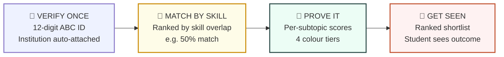
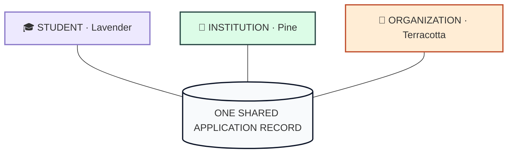
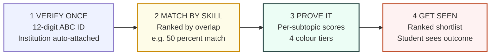
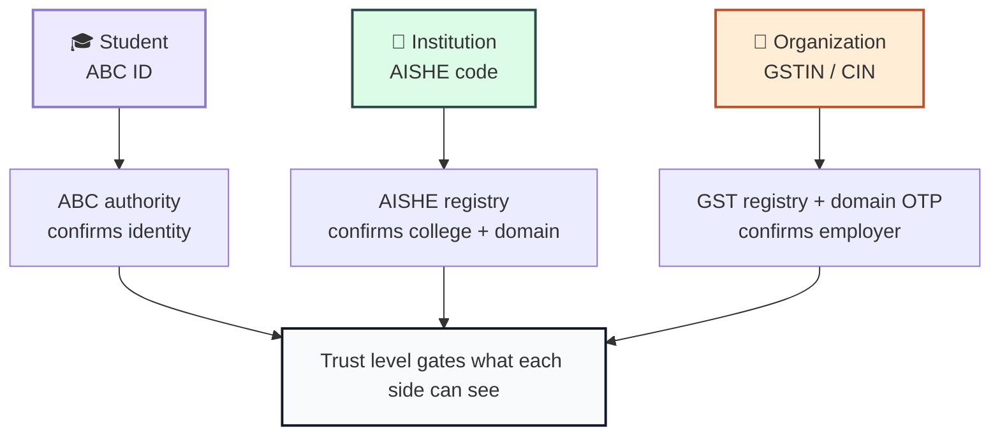
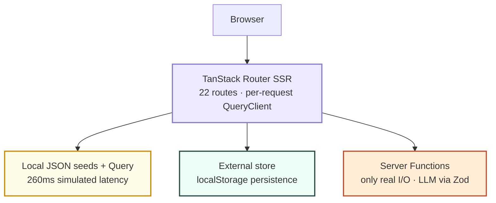
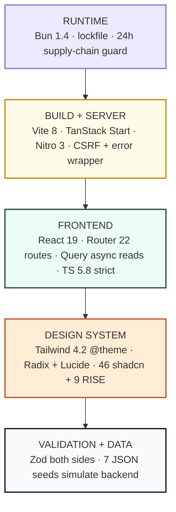
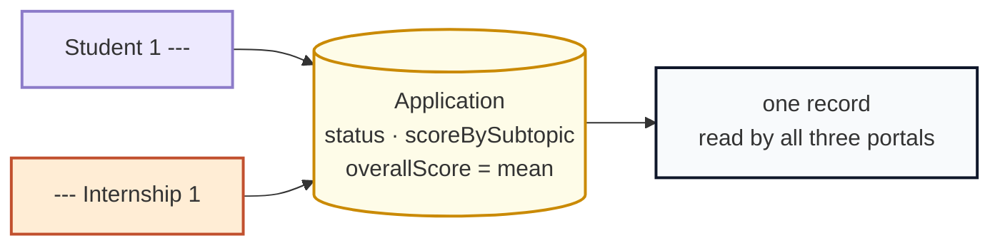

<div align="center">

<!-- HERO -->


# 🌅 RISE
### Skill-matched internships for verified students

> **Verify your academic identity once. Get matched by the skills you actually have.**
> **Get ranked on what you can prove — not what your resume claims.**

[](LICENSE)
[](CONTRIBUTING.md)
[](https://github.com/ayushjha-dev/RISE/pulls)
[](https://github.com/ayushjha-dev/RISE/stargazers)

[](https://react.dev)
[](https://www.typescriptlang.org)
[](https://tanstack.com/start)
[](https://tailwindcss.com)
[](https://bun.sh)
[](https://vite.dev)

**[✨ Getting Started](#-getting-started) • [🏛️ Architecture](#-architecture) • [🛡️ Verification](#-verification-and-trust) • [🤝 Contributing](CONTRIBUTING.md) • [📚 Docs](#-documentation)**

</div>

---

<div align="center">

### 🧭 Table of Contents

<details>
<summary><b>Click to expand</b></summary>

- [🌟 Why RISE?](#-why-rise--the-problem-we-solve)
- [💡 How RISE Works](#-how-rise-works)
- [🎓 Three Portals, One Ecosystem](#-three-portals-one-ecosystem)
- [⚙️ Detailed Flow](#-detailed-flow--verify-match-prove-seen)
- [📊 Scoring Philosophy](#-scoring-philosophy--a-feature-not-a-verdict)
- [🛡️ Verification and Trust](#-verification-and-trust)
- [✨ Feature Tour](#-feature-tour)
- [🛠️ Tech Stack](#-tech-stack)
- [🏛️ Architecture](#-architecture)
- [🧬 Data Model & Scoring](#-data-model--scoring)
- [🎨 Design System](#-design-system)
- [🚀 Getting Started](#-getting-started)
- [📚 Documentation](#-documentation)
- [🗺️ Roadmap](#-roadmap)
- [⚠️ Project Status](#-project-status--honest-limitations)
- [🤝 Contributing](#-contributing)
- [🔒 Security](#-security)
- [📄 License](#-license)

</details>

<br/>

> _“Resumes claim. RISE proves.”_

<table>
<tr>
<td align="center">🎓<br/><b>For Students</b><br/><sub>Verified profile → skill-matched roles → provable scores</sub></td>
<td align="center">🏢<br/><b>For Employers</b><br/><sub>Ranked evidence, not keyword soup. Shortlist in minutes.</sub></td>
<td align="center">🏫<br/><b>For Colleges</b><br/><sub>Cohort skill gaps, top talent, placement funnel — live.</sub></td>
</tr>
</table>

</div>

---

## 🌟 Why RISE? — The Problem We Solve

> Meet **Aarav**, a third-year student from Coimbatore. He spent four months
> learning React properly — he can build a working dashboard unaided.
> He has never been invited to a single interview.

Aarav is in his third year at a college in Coimbatore. He has spent four months
learning React properly. He can build a working dashboard unaided. He has never
been invited to a single interview.

Across the country, roughly a million students apply to internships this way each
year, and almost all of them hit the same wall. Not because they lack the skills,
but because nothing in the hiring process can see those skills.

| # | 💔 Failure | 🔍 What happens today | 📉 Consequence |
|---|------------|----------------------|----------------|
| 1 | **Nobody can confirm who anyone is** | Names, emails & colleges are self-reported free text | Employers trust no one, fall back to keywords |
| 2 | **Matching is keyword comparison** | `SQL` in a bullet = `SQL` mastered | Real skill loses to resume optimization |
| 3 | **Feedback arrives too late to help** | Interviews give no subtopic breakdown | Students repeat the same invisible gap |

### 1️⃣ Nobody can confirm who anyone is

A recruiter receives four hundred applications for one role. The name on a
resume is self-reported, the email is self-chosen, and the college affiliation
is a free-text field. Some of those applicants did not attend the college they
name. Nobody can tell. So every employer quietly assumes the worst and falls back
on the cheapest available signal.

### 2️⃣ Matching is keyword comparison

So the signal becomes keywords. A student who wrote "SQL" in a bullet point
scores identically to one who can actually write a join. Both read as the same
word in the same file. Resume optimization replaces skill development, because
optimization is what the filter rewards. Meanwhile a genuinely strong candidate
who describes their work in their own words is filtered out for using different
vocabulary than the job posting.

### 3️⃣ Feedback arrives too late to help

Suppose Aarav does get an interview and does well. Nobody tells him why. He never
learns that his SQL was the gap, because no one ever told him it was the gap. He
cannot fix what he cannot see, so the same weakness follows him to the next
application, and the next.

Meanwhile the college sees only an aggregate: a placement percentage, moving
slowly, with no indication of which skills are actually thin across the cohort.
The placement officer cannot advise a student toward the subject that would help
them most, because that information does not exist anywhere.

> **Three failures, and they compound.** Unverifiable identity forces keyword
> matching, keyword matching produces no real feedback, and no feedback means
> students never close their gaps.

---

## 💡 How RISE Works

RISE replaces resume parsing with **verified identity + per-skill evidence**.
It is built on three simple ideas:

| Principle | ✨ What it means | 🎯 Why it matters |
|-----------|-----------------|-------------------|
| **✅ Verify once, apply everywhere** | A student confirms their [ABC ID](https://www.abc.gov.in/) once; the authority returns their institution | Student–college link is proven by a third party, not self-claimed |
| **🧠 Skills over keywords** | Openings ranked by real overlap between verified profile skills and role requirements | Knowing SQL beats merely writing “SQL” |
| **📊 Evidence per subtopic** | Short role-specific assessments score each subtopic separately | A `React: 100, SQL: 41` profile shows the exact gap — and which course fixes it |

> Because all three portals read from **one shared application record**, the same
> application is visible to the student, the employer's shortlist, and the
> college's placement dashboard — at the same time.

### 🔄 The 4-step journey



**The score is a feature, not a verdict.** Overall score = mean of subtopics
(for sorting only). The UI always expands to *which* subtopic is strong or thin.

## 🎓 Three Portals, One Ecosystem

Three colour-scoped portals share **one application record** — the student sees status, the employer sees ranked evidence, the college sees the cohort. All at once.

| 🎓 **STUDENT** · Lavender `#8c7bc9` | 🏫 **INSTITUTION** · Pine `#2b4a47` | 🏢 **ORGANIZATION** · Terracotta `#c1502e` |
|:---:|:---:|:---:|
| ✅ Verify ABC ID | 📊 Cohort dashboard | ⚡ Post a role in 2 min |
| 🧠 Skill matches | 📈 Subtopic averages | 🏆 Ranked shortlists |
| 📝 Per-subtopic scores | 🌟 Top performers | 🔍 Evidence over resume |
| 📬 Apply and track | 🔄 Conversion funnel | 🎯 Skill filtering |



> Each portal is a colour-scoped section of one application. The shell sets `data-portal`, the accent swaps, and nothing else changes.

## ⚙️ Detailed Flow — Verify, Match, Prove, Seen



| Step | What happens | Example |
|:---:|---|---|
| **1 · Verify once** | Student enters 12-digit ABC ID; institution auto-attaches from the authority response | ABC API (planned) confirms identity |
| **2 · Match by skill** | Internships ranked by real skill overlap, not keywords | `React 100, SQL 41` → **50% match** |
| **3 · Prove it** | Short assessment scores each subtopic separately | `JavaScript 80, React 100, SQL 41` → mean 80 |
| **4 · Get seen** | Organization shortlists from ranked evidence; student sees the outcome | 4 colour tiers on every value |

## 📊 Scoring Philosophy — A Feature, Not a Verdict

A single 72 out of 100 tells an employer nothing. RISE stores the subtopic map
`{ React: 100, SQL: 41 }` and derives the mean only for sorting. Every tier
boundary is visual, so a weak subtopic cannot be missed:

| Tier | Range | Token | Meaning |
|------|-------|-------|---------|
| 🔴 Weak | `0–39` | `--score-weak` · clay | Needs work |
| 🟡 Developing | `40–64` | `--score-mid` · amber | Getting there |
| 🟢 Strong | `65–84` | `--score-good` · pine | Reliable |
| 💎 Excellent | `85–100` | `--score-high` · emerald | Ready now |

> 💡 A student scoring 100 on React and 41 on SQL is not an “80” candidate.
> They are a **frontend candidate who needs about a week of SQL** — and the Learning
> portal surfaces exactly that course first. That is the feedback Aarav never got.

## 🛡️ Verification and Trust

> _Verification is the product — not a checkbox on it._ A ranking is worthless if the identity underneath it is fabricated, so every account is anchored to a registry the actor does not control alone.

| Party | 🔑 Anchor | 🏛️ Registry | ✅ Proves |
|-------|-----------|--------------|-----------|
| 🎓 Student | ABC ID · 12 digits | Academic Bank of Credits | The student |
| 🏫 Institution | AISHE code | AISHE, Ministry of Education | The college |
| 🏢 Organization | GSTIN / CIN + domain email | GST registry + email delivery | The employer |



> 🔐 Two details matter more than the rest:
>
> - The institution is taken from the **ABC response**, not from what the student typed. A student cannot attach themselves to a college of their choosing.
> - An organization needs **both** a valid GSTIN **and** control of the company's email domain. Either alone can be faked by copying a real company's details.

📖 Full flow, trust levels, API contracts and failure handling: **[docs/VERIFICATION.md](docs/VERIFICATION.md)**.

---

## ✨ Feature Tour

> Every screen listed here is **real, running code** in `src/routes/` — 22 typed file-based routes.

### 🌐 Public

| Route       | Screen       | What it does                                      |
| ----------- | ------------ | ------------------------------------------------- |
| `/`         | Landing      | Hero, role cards, journey band, portal stats, CTA |
| `/auth`     | Sign in      | Role tabs, account picker                         |
| `/register` | Registration | 4 steps: details, ABC verify, college, preview    |

### 🎓 Student Portal

| Route                      | Screen      | What it does                                            |
| -------------------------- | ----------- | ------------------------------------------------------- |
| `/student`                 | Dashboard   | Stat tiles, status donut, skill meters, journey rail    |
| `/student/internships`     | Internships | Skill filter rail, match-score ring, empty/error states |
| `/student/internships/$id` | Role detail | Full posting, match breakdown, apply action             |
| `/student/assessment/$id`  | Assessment  | One question at a time, progress rail per subtopic      |
| `/student/report/$id`      | Report      | Hero score ring, ranked bars, plain-language takeaways  |
| `/student/learning`        | Learning    | NPTEL and Swayam courses, weakest subtopics first       |
| `/student/profile`         | Profile     | Identity panel, skills, links, availability             |

### 🏫 Institution Portal

| Route                   | Screen    | What it does                                     |
| ----------------------- | --------- | ------------------------------------------------ |
| `/institution`          | Dashboard | Cohort stats, subtopic radar, status donut, bars |
| `/institution/students` | Students  | Cohort table with per-student scores             |
| `/institution/profile`  | Profile   | AISHE code, affiliation, placement officer       |

### 🏢 Organization Portal

| Route                      | Screen      | What it does                                            |
| -------------------------- | ----------- | ------------------------------------------------------- |
| `/organization`            | Dashboard   | Pipeline stats, conversion, recent applicants           |
| `/organization/applicants` | Applicants  | Ranked shortlist, subtopic drill-down, shortlist/reject |
| `/organization/post`       | Post a role | Manual form or AI draft, reviewable before publishing   |
| `/organization/profile`    | Profile     | Industry, city, about, hiring contact                   |

---

## 🛠️ Tech Stack

<div align="center">

| Layer | Technology | Version |
|:-----:|------------|---------|
| ⚛️ UI Runtime | React | `19.2` |
| 🛣️ Routing + SSR | TanStack Start / Router | `1.168 / 1.170` |
| 🔄 Server State | TanStack Query | `5.101` |
| 🎨 Styling | Tailwind CSS | `4.2` |
| 🧱 Components | Radix UI + shadcn/ui + RISE system | `46 + 9` |
| 🔷 Language | TypeScript (strict) | `5.8` |
| ✅ Validation | Zod (client + server + LLM) | `3.25` |
| ⚡ Build | Vite | `8.1` |
| 🧊 Runtime / PM | Bun (+ `bun.lock`, 24h supply-chain guard) | `1.4+` |
| 🌐 Server | Nitro 3 (Cloudflare target) + h3 | `3.0` |
| 🎯 Icons | Lucide | latest |
| 📊 Charts | Hand-drawn SVG (Recharts intentionally unused) | — |

</div>

## 🏛️ Architecture



> 💡 **The important idea:** the data layer is local JSON, but every read is shaped
> like a network call and routed through TanStack Query. Loading, error and empty
> states are therefore written once and uniform across every screen — so swapping in
> a real API later is a change in **one file** (`src/lib/api.ts`), not twenty-two.

### 🧱 Layered Choices



Each layer depends only on the one below it:

| 🧩 Layer | Choice | 💡 Why it is there |
|---|---|---|
| Runtime | Bun | Fast installs, committed lockfile |
| Build | Vite 8 + Nitro 3 | Fast SSR dev, Cloudflare-oriented output |
| Framework | TanStack Start 1.168 | Server functions with no framework lock-in |
| Routing | TanStack Router 1.170 | Types flow from the route tree into links and params |
| Server state | TanStack Query 5.101 | Forces every read async, so loading and error states are real |
| UI | React 19 | `useSyncExternalStore` for the local store |
| Language | TypeScript 5.8 | `strict`, plus `noUncheckedIndexedAccess` |
| Styling | Tailwind CSS 4.2 | CSS-first `@theme`, custom `@utility` layer |
| Components | shadcn/ui (46) + RISE (9) | Accessible primitives, then the product's visual language |
| Validation | Zod 3.25 | Both sides of the only network call |

> 📊 **On Recharts:** it is installed, but `src/components/rise/charts.tsx` is
> deliberately hand-authored SVG — no chart-library chrome, no default palette, no dead plot area. Every value colour is read from the RISE score ramp.

### 🛡️ Resilience, Not Just Rendering

SSR failures in TanStack Start are unusually easy to lose, so RISE handles them in
three places:

- `src/server.ts` wraps the server entry and recovers the original stack when h3
  swallows a throw into a generic `{"unhandled":true}` 500.
- `src/start.ts` registers middleware that converts unknown throws into a styled
  HTML error page, while re-throwing anything carrying a `statusCode`.
- `src/lib/error-capture.ts` captures the original `Error` out of band and walks
  up to 5 levels of `cause`, so the log keeps message, stack and chain.

`csrfMiddleware` is re-declared manually in `start.ts`, because defining that file
opts out of Start's automatic installation. Without it, server functions would be
unprotected from cross-site requests.

## 🎨 Design System

> A warm paper canvas with one saturated accent per portal — closer to printed matter than to a SaaS dashboard.

| Token | Value | Role |
|-------|-------|------|
| `--canvas` | `#fbf8f2` | 🌄 Warm paper background |
| `--surface` | `#ffffff` | 🃏 Cards |
| `--ink` | `#141311` | ✒️ Headings |
| `--body` | `#4a463f` | 📝 Body copy |
| `--muted` | `#8a8478` | 🌫️ Secondary text |
| `--hairline` | `#e4decf` | 📏 Borders and rules |
| `--student-accent` | `#8c7bc9` | 🎓 Lavender portal |
| `--institution-accent` | `#2b4a47` | 🏫 Pine portal |
| `--organization-accent` | `#c1502e` | 🏢 Terracotta portal |

Type pairs Fraunces (display serif) against Inter (UI sans). Radii step
6, 10, 14, 20, pill. Depth comes from a paper grain overlay, tinted bands,
hairline curves and a two-stop `raised` elevation ramp, never flat grey shadows.

Portals recolour purely by CSS variable swap:

```css
[data-portal="student"] {
  --accent: var(--student-accent);
}
[data-portal="institution"] {
  --accent: var(--institution-accent);
}
[data-portal="organization"] {
  --accent: var(--organization-accent);
}
```

Scroll reveals, count-ups, ring fills and card lifts all route through
`useReveal`, which checks `prefers-reduced-motion` first and reveals immediately
when reduced motion is requested. Animation is never a prerequisite for reading
content.

📖 Full token reference and component inventory: **[docs/DESIGN_SYSTEM.md](docs/DESIGN_SYSTEM.md)**.

---

## 🧬 Data Model & Scoring

> Seven JSON seed files under `src/data/` stand in for the API.

| Entity | 📁 File | 🌱 Seeds | 🔑 Key fields |
|--------|---------|----------|---------------|
| `Student` | `students.json` | 10 | `abcId`, `abcVerified`, `institutionId`, `skills[]` |
| `Internship` | `internships.json` | 8 | `orgId`, `skillsRequired[]`, `assessmentId` |
| `Organization` | `organizations.json` | 5 | `industry`, `city`, `about` |
| `Institution` | `institutions.json` | 3 | `aisheCode`, `affiliation`, placement officer |
| `Application` ⭐ | `applications.json` | 10 | `status`, `scoreBySubtopic`, `overallScore` |
| `Assessment` | `assessments.json` | 1 track | `subtopics[]` → `questions[]` → `correctIndex` |
| `LearningLink` | `nptelLinks.json` | 10 | `provider`, `institute`, `weeks`, `url` |

> ⭐ The join that makes the platform work is **`Application`**:



📖 Field-by-field reference in **[docs/DATA_MODEL.md](docs/DATA_MODEL.md)**.

---

## 🚀 Getting Started

> ⚡ **60 seconds to running.** No environment variables required — the app runs fully out of the box.

### ✅ Prerequisites

| Tool | Version | Notes |
|------|---------|-------|
| 🧊 Bun *(recommended)* | `1.4+` | Repo ships `bun.lock` |
| 🟢 Node.js *(alternative)* | `20+` | Use with npm |
| 🔧 Git | any | To clone |

### 📥 Install & Run

```bash
# 1 — Clone
git clone https://github.com/ayushjha-dev/RISE.git
cd RISE

# 2 — Install
bun install          # or: npm install

# 3 — Run (dev server with SSR + HMR)
bun dev              # or: npm run dev
```

🎉 Open the printed local URL and **sign in as any seeded student, institution or organization**. No password, no backend — just pick a demo account.

### 📁 Project Structure

```
src/
├── routes/         # 📄 file-based pages — one file per URL (22 routes)
├── components/
│   ├── rise/       # 🎨 the RISE design system — put new UI here
│   └── ui/         # 🧱 46 shadcn components (available, mostly unused)
├── data/           # 🌱 7 JSON seeds (simulated backend)
├── hooks/          # 🪝 use-reveal, use-mobile
├── lib/            # 🧠 api, store, portal, score-color, jd.functions, errors
├── styles.css      # 💅 the whole design system
├── start.ts        # ⚙️ TanStack Start instance (error + CSRF middleware)
├── server.ts       # 🖥️ SSR entry wrapper
└── routeTree.gen.ts # 🤖 GENERATED — never edit
```

### 🔐 Environment Variables

> Every variable is **optional**. With none set the app runs fully — the AI description generator simply reports that it is not configured.

| Variable | Purpose |
|----------|---------|
| `AI_API_KEY` | 🔑 Bearer token for an OpenAI-compatible `/chat/completions` endpoint |
| `AI_BASE_URL` | 🌐 Base URL including `/v1` |
| `AI_MODEL` | 🤖 Provider-specific model id, e.g. `gemini-2.0-flash` |

Copy [`.env.example`](.env.example) to `.env` to get started. Works with any OpenAI-compatible provider: **Gemini · OpenAI · OpenRouter · Groq · Together · self-hosted vLLM**. The key is read only on the server, and `.env` is gitignored.

### 📜 Scripts

| Command | Action |
|---------|--------|
| `bun dev` | 🔥 Vite dev server with SSR and HMR |
| `bun run build` | 📦 Production build (Nitro, Cloudflare target) |
| `bun run build:dev` | 🛠️ Development-mode build, unminified |
| `bun run preview` | 👀 Serve the production build locally |
| `bun run lint` | 🧹 ESLint 9 flat config, including Prettier |
| `bun run format` | ✨ Prettier write (100 cols, double quotes) |

> 🛡️ **Supply-chain note:** `bunfig.toml` enforces a 24-hour supply-chain guard — package versions published less than a day ago are skipped, with a narrow, explicit allowlist.

---

## 📚 Documentation

| Document | 📖 Covers |
|----------|-----------|
| **[docs/ARCHITECTURE.md](docs/ARCHITECTURE.md)** | 🏛️ Stack rationale, routing, state, data layer, SSR errors |
| **[docs/VERIFICATION.md](docs/VERIFICATION.md)** | 🛡️ How each party is verified, trust levels, API contracts |
| **[docs/DESIGN_SYSTEM.md](docs/DESIGN_SYSTEM.md)** | 🎨 Every token, type scale, motion utilities, components |
| **[docs/DATA_MODEL.md](docs/DATA_MODEL.md)** | 🧬 Entity-by-entity field reference, relations, score maths |
| **[src/routes/README.md](src/routes/README.md)** | 🛣️ File-based routing conventions and URL mapping table |
| **[CONTRIBUTING.md](CONTRIBUTING.md)** | 🤝 Setup, conventions, review process |
| **[SECURITY.md](SECURITY.md)** | 🔒 Reporting a vulnerability |

---

## 🗺️ Roadmap

### ✅ Shipped

| Status | Milestone |
|:------:|-----------|
| ✅ | 🎓 Three portals sharing application records |
| ✅ | 🔐 ABC ID format check + institution auto-attachment |
| ✅ | 🧠 Skill-overlap matching with match scores |
| ✅ | 📊 Per-subtopic assessment scoring + colour tiers |
| ✅ | 🏆 Ranked applicant shortlists |
| ✅ | 📈 Cohort analytics for institutions |
| ✅ | 🎨 Adaptive design system, hand-drawn SVG charts, motion pass |

### 🔜 Up Next

- [ ] 🔐 Real ABC registry verification for students
- [ ] 🏫 AISHE verification for institutions · GSTIN + domain for organizations
- [ ] 🔑 Server-side authentication, sessions and authorization
- [ ] 💾 Real persistence, replacing JSON seeds with a database
- [ ] ✍️ Assessment authoring UI for organizations
- [ ] 📚 Assessment tracks beyond Web Development
- [ ] 📄 Resume parsing as a supplementary signal — never the primary one
- [ ] 🧪 Automated tests (Vitest is installed but not yet wired up)

---

## ⚠️ Project Status — Honest Limitations

> This is a **working front-end prototype** with a simulated data layer. Please be clear-eyed about what that means:

| # | ⚠️ Limitation | 🔍 Reality today |
|---|---------------|------------------|
| 1 | **No real backend** | Applications persist to `localStorage` only — clearing site data resets the demo |
| 2 | **ABC check is a regex** | Any 12 digits “verify”; no call to the ABC authority yet; institutions & orgs unverified |
| 3 | **Sign-in is a picker** | Role + account picker — no password, session token, or real authorization boundary (portal guards are UX, not security) |
| 4 | **Fictional seeds** | All people, colleges and companies are invented for the demo |

The verification model is fully specified in [docs/VERIFICATION.md](docs/VERIFICATION.md), but only the format check runs today. Treat this as a **high-fidelity product prototype** and a reference implementation of the design system — not a deployable production system.

---

## 🤝 Contributing

We love contributions! 🎉 Here's how to get started:

```bash
bun run lint      # must be clean
bun run format    # commit the result
bun run build     # must succeed
```

- 📖 Read **[CONTRIBUTING.md](CONTRIBUTING.md)** for setup, conventions & review process
- 🐛 Report bugs with the bug template (portal + route + browser + console output)
- 💡 Request features with the feature template (problem + affected portal)
- ✅ Good PRs are scoped, show mobile **and** desktop, and update `docs/` when behaviour changes

---

## 🔒 Security

Found a vulnerability? Please report it privately per **[SECURITY.md](SECURITY.md)** — do not open a public issue.

---

## 📄 License

Released under the MIT License (see [LICENSE](LICENSE)).

Technology marks used in the interface come from
[simple-icons](https://simpleicons.org) (CC0-1.0) and remain the property of their
respective owners, used unmodified.

---

<div align="center">

### 🌅 Built with React, TypeScript and TanStack Start

⭐ **If RISE helped you, please star the repo — it helps more students get seen for what they can prove.**

💬 Questions, ideas or bug reports are welcome in the [issue tracker](https://github.com/ayushjha-dev/RISE/issues).

[](https://github.com/ayushjha-dev/RISE/stargazers)

</div>
